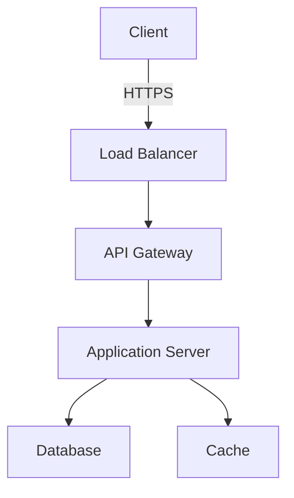

# /document - Professional Documentation Generator

**Purpose**: Generate comprehensive documentation for code, APIs, systems, and projects  
**Category**: Documentation  
**Syntax**: `/document $ARGUMENTS`

## Examples

```bash
/document                              # Auto-detect and generate docs
/document @src/ --type api             # Generate API documentation
/document --type readme --detailed     # Create comprehensive README
/document @components/ --type code     # Document code components
/document !jsdoc --format html         # Run JSDoc and format output
/document --type architecture --diagrams # System architecture docs
```

## Command Arguments

**$ARGUMENTS Processing**:
- `[target]` - Files/directories to document (default: auto-detect project)
- `@<path>` - Explicit file or directory targeting
- `!<command>` - Execute documentation command (JSDoc, Sphinx, etc.)
- `--<flag>` - Documentation type and configuration options

### Documentation Types

- `--type api`: API documentation with endpoints and schemas
- `--type code`: In-code documentation (JSDoc, docstrings)
- `--type readme`: Project README with setup and usage
- `--type architecture`: System design and architecture docs
- `--type user`: End-user guides and tutorials
- `--type dev`: Developer documentation for contributors

### Output Formats

- `--format markdown`: GitHub-flavored markdown (default)
- `--format html`: Static HTML documentation
- `--format pdf`: PDF document generation
- `--format openapi`: OpenAPI/Swagger specification
- `--format docusaurus`: Docusaurus-compatible format

### Documentation Styles

- `--concise`: Essential information only
- `--detailed`: Comprehensive with examples (default)
- `--tutorial`: Step-by-step guide format
- `--reference`: API reference style

### Control Options

- `--output [path]`: Output location (default: ./docs/)
- `--include-private`: Document private methods
- `--examples`: Generate usage examples
- `--diagrams`: Include architecture diagrams
- `--coverage`: Report documentation coverage

### Universal SuperClaude Flags

- `--plan`: Show documentation generation plan
- `--think`: Analyze codebase structure (~4K tokens)
- `--think-hard`: Deep documentation analysis (~10K tokens)
- `--introspect`: Show documentation decision process

### Persona Integration

- `--persona-mentor`: Educational documentation focus
- `--persona-architect`: System design documentation
- `--persona-analyzer`: Technical reference documentation

### MCP Server Control

- `--c7`: Enable Context7 for framework documentation patterns
- `--seq`: Enable Sequential for complex analysis
- `--magic`: Enable Magic for UI component docs
- `--no-mcp`: Use only native Claude Code tools

## Workflow Process

### Phase 1: Analysis & Discovery
1. **Project Detection**: Identify language, framework, structure
2. **Documentation Scan**: Find existing docs and patterns
3. **Component Mapping**: Analyze code structure and APIs
4. **Coverage Assessment**: Identify documentation gaps

### Phase 2: Content Generation
1. **Template Selection**: Choose appropriate doc templates
2. **Content Extraction**: Pull from code, comments, tests
3. **Example Generation**: Create usage examples from tests
4. **Cross-Referencing**: Link related documentation

### Phase 3: Enhancement & Formatting
1. **Structure Organization**: Create logical documentation flow
2. **Example Enhancement**: Add practical code examples
3. **Diagram Generation**: Create visual representations
4. **Navigation Building**: Generate TOC and indexes

### Phase 4: Validation & Output
1. **Link Validation**: Verify all references work
2. **Example Testing**: Validate code examples
3. **Format Conversion**: Generate requested output format
4. **Coverage Reporting**: Document completeness metrics

## Documentation Domains

### API Documentation

**Endpoint Documentation**:
```markdown
## GET /api/users/:id

Retrieves a user by their unique identifier.

### Parameters
- `id` (string, required): User's unique identifier

### Response
```json
{
  "id": "123",
  "name": "John Doe",
  "email": "john@example.com"
}
```

### Errors
- `404`: User not found
- `401`: Unauthorized access
```

**OpenAPI Generation**:
```yaml
paths:
  /api/users/{id}:
    get:
      summary: Get user by ID
      parameters:
        - name: id
          in: path
          required: true
          schema:
            type: string
      responses:
        '200':
          description: User found
          content:
            application/json:
              schema:
                $ref: '#/components/schemas/User'
```

### Code Documentation

**JSDoc Generation**:
```javascript
/**
 * Calculates the total price including tax.
 * @param {number} price - Base price of the item
 * @param {number} taxRate - Tax rate as decimal (e.g., 0.08 for 8%)
 * @returns {number} Total price including tax
 * @throws {Error} If price or taxRate is negative
 * @example
 * // Calculate price with 8% tax
 * const total = calculateTotal(100, 0.08);
 * console.log(total); // 108
 */
```

**Python Docstrings**:
```python
"""
Calculate the total price including tax.

Args:
    price (float): Base price of the item
    tax_rate (float): Tax rate as decimal (e.g., 0.08 for 8%)

Returns:
    float: Total price including tax

Raises:
    ValueError: If price or tax_rate is negative

Example:
    >>> calculate_total(100, 0.08)
    108.0
"""
```

### README Generation

**Project Structure**:
```markdown
# Project Name

Brief description of what this project does and why it exists.

## Features
- ✅ Feature 1: Description
- ✅ Feature 2: Description
- ✅ Feature 3: Description

## Installation

```bash
npm install project-name
# or
yarn add project-name
```

## Quick Start

```javascript
const project = require('project-name');

// Basic usage example
project.doSomething();
```

## API Reference

See [API Documentation](./docs/api.md) for detailed reference.

## Contributing

See [CONTRIBUTING.md](./CONTRIBUTING.md) for development setup.
```

### Architecture Documentation

**System Overview**:
```markdown
# System Architecture

## Overview
High-level description of system architecture and design decisions.

## Components

### Frontend
- **Technology**: React 18 with TypeScript
- **State Management**: Redux Toolkit
- **Styling**: Tailwind CSS

### Backend
- **Technology**: Node.js with Express
- **Database**: PostgreSQL 14
- **Cache**: Redis 6

### Infrastructure
- **Hosting**: AWS ECS
- **CDN**: CloudFront
- **Monitoring**: DataDog

## Data Flow

```

## Quality Standards

### Documentation Coverage
```bash
📊 Documentation Coverage Report
━━━━━━━━━━━━━━━━━━━━━━━━━━━━━
✅ Public APIs: 100% documented
⚠️ Private APIs: 67% documented
✅ README: Complete with examples
✅ Architecture: Diagrams included

📈 Overall Coverage: 89%
🎯 Target Coverage: 85%
✅ Quality Gate: PASSED
```

### Validation Checks
1. **Completeness**: All public APIs documented
2. **Accuracy**: Examples are executable
3. **Currency**: Docs match current code
4. **Clarity**: Clear, concise language
5. **Navigation**: Proper cross-references

## Example Workflows

### API Documentation Generation
```bash
/document @src/api/ --type api --format openapi

🔍 Analyzing API endpoints...
📊 Found 42 endpoints to document
📝 Generating OpenAPI specification...
✅ Validation passed

📄 Output: docs/openapi.yaml
🌐 Preview: http://localhost:3000/api-docs
```

### Code Documentation Update
```bash
/document @src/ --type code --include-private

📝 Documenting code components...
🔍 Found 156 functions to document
⚠️ 23 functions missing documentation
🔧 Generating documentation...

✅ Updated 23 files
📊 Coverage: 67% → 100%
```

### README Generation
```bash
/document --type readme --detailed --examples

📚 Generating comprehensive README...
🔍 Analyzing project structure...
📝 Extracting features and usage...
✅ Adding installation instructions...

📄 Created: README.md
📄 Created: docs/GETTING_STARTED.md
📄 Created: docs/API_REFERENCE.md
```

### Architecture Documentation
```bash
/document --type architecture --diagrams

🏗️ Documenting system architecture...
🔍 Analyzing component structure...
📊 Generating architecture diagrams...
✅ Creating decision records...

📁 Output directory: docs/architecture/
├─ overview.md
├─ components.md
├─ data-flow.md
└─ diagrams/
```

## Integration with SuperClaude

### Intelligent Analysis
- **Code Understanding**: Deep analysis of code patterns
- **Example Extraction**: Generate examples from tests
- **Cross-Reference**: Automatic linking and navigation
- **Coverage Tracking**: Monitor documentation completeness

### Framework Integration
- **Auto-Detection**: Identify documentation conventions
- **Pattern Matching**: Use framework-specific patterns
- **Tool Integration**: Work with existing doc tools
- **Format Flexibility**: Support multiple output formats

---

*SuperClaude Enhanced | Professional Documentation | Intelligent Generation*